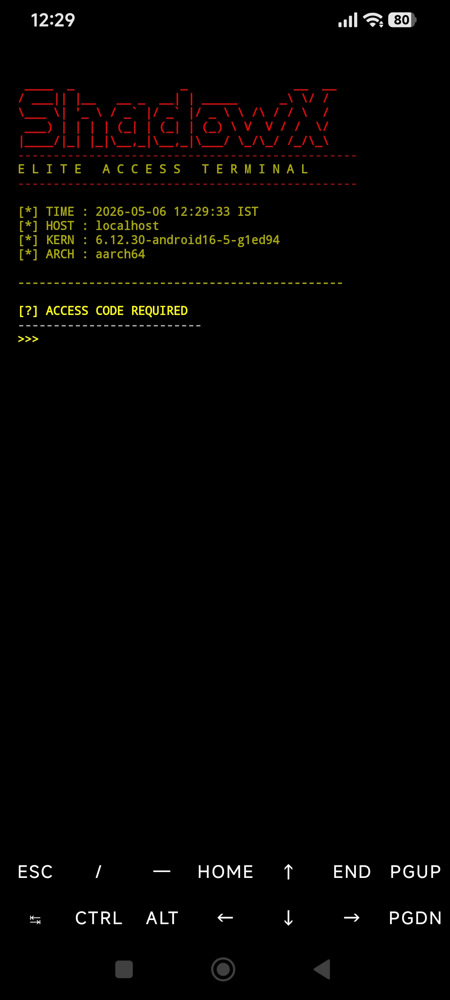
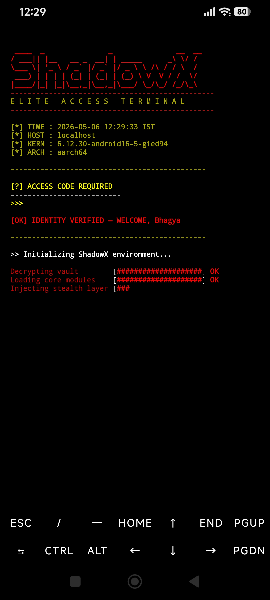
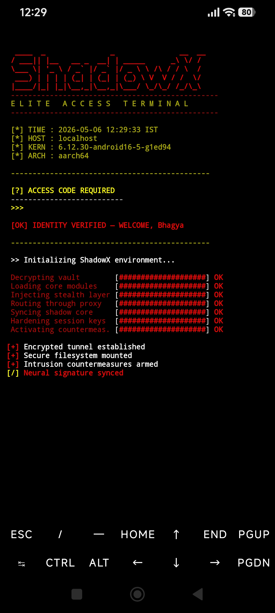
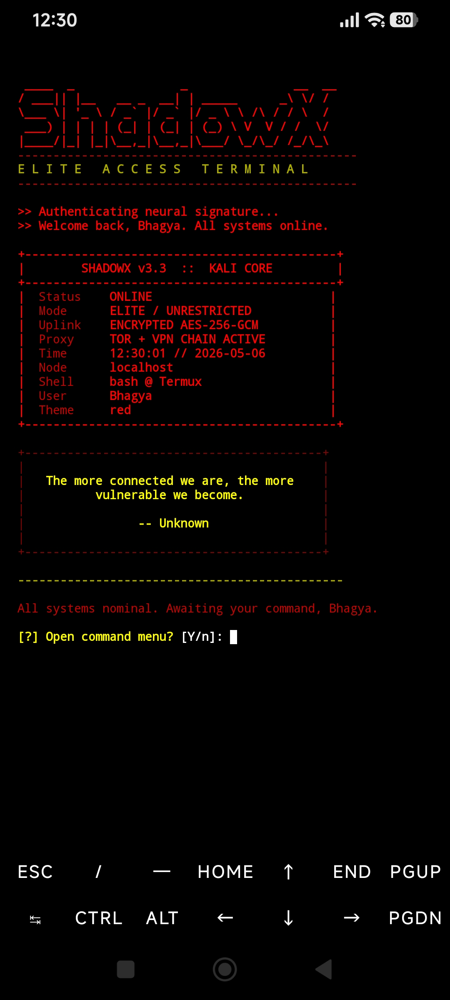
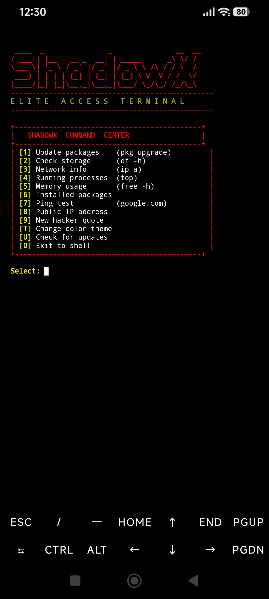

# ShadowX — Elite Access Terminal for Termux

[](https://github.com/bhagyaff001-prog/shadowx)
[](LICENSE)
[](https://termux.dev)
[](https://www.gnu.org/software/bash/)

```
   ____  _               _               __  __
  / ___|| |__   __ _  __| | _____      _\ \/ /
  \___ \| '_ \ / _` |/ _` |/ _ \ \ /\ / / \  /
   ___) | | | | (_| | (_| | (_) \ V  V / /  \/
  |____/|_| |_|\__,_|\__,_|\___/ \_/\_/ /_/\_\
  ------------------------------------------------
       E L I T E   A C C E S S   T E R M I N A L
  ------------------------------------------------
```

A fully-featured, animated hacker-aesthetic boot screen for **Termux**.
Sets up on first run, auto-boots every time you open Termux, and adapts to your screen size.

---

## Screenshots

| Boot Screen | Login | Status Panel |
|:-----------:|:-----:|:------------:|
|  |  |  |

| Hacker Quote | Command Menu | Theme: Red |
|:------------:|:------------:|:----------:|
|  |  |  |

---

## Features

- **Animated boot sequence** — hex rain, progress bars, spinners, glitch effects
- **Password protected login** — 3 attempts before lockout with animation
- **First-run setup wizard** — set your name, password, and theme on first launch
- **4 color themes** — Green / Red / Blue / Cyan, switchable anytime
- **Config file** (`~/.shadowxrc`) — settings survive updates
- **Auto screen detection** — adapts panel width for phone portrait, landscape, and desktop
- **Random hacker quotes** — 20 built-in quotes shown on every login
- **Auto-update checker** — silently checks GitHub on boot, notifies if update available
- **Quick command menu** — run common Termux commands from a built-in menu
- **Clean uninstaller** — removes script, config, and .bashrc entry in one command

---

## Installation

### One-line install (recommended)

```bash
curl -sL https://raw.githubusercontent.com/bhagyaff001-prog/shadowx/main/shadowx_boot.sh -o ~/shadowx_boot.sh && chmod +x ~/shadowx_boot.sh && bash ~/shadowx_boot.sh --install
```

### Manual install

```bash
# 1. Download
curl -sL https://raw.githubusercontent.com/bhagyaff001-prog/shadowx/main/shadowx_boot.sh -o ~/shadowx_boot.sh

# 2. Make executable
chmod +x ~/shadowx_boot.sh

# 3. Install (sets auto-boot in .bashrc)
bash ~/shadowx_boot.sh --install

# 4. Reopen Termux — login screen appears automatically
```

> **First launch** will run the setup wizard to set your name, password, and theme.

---

## Usage

```bash
# Run manually
bash ~/shadowx_boot.sh

# Install & enable auto-boot
bash ~/shadowx_boot.sh --install

# Remove everything
bash ~/shadowx_boot.sh --uninstall

# Force update from GitHub
bash ~/shadowx_boot.sh --update

# Re-run setup wizard (change name, password)
bash ~/shadowx_boot.sh --config

# Change theme only
bash ~/shadowx_boot.sh --theme
```

---

## Configuration

Settings are stored in `~/.shadowxrc`:

```bash
BOSS_NAME="YourName"
ACCESS_CODE="yourpassword"
THEME="green"
```

This file is created automatically on first run with `chmod 600` permissions (only you can read it).
Settings survive script updates — your name, password, and theme are never overwritten.

---

## Themes

| Name    | Color   | Description       |
|---------|---------|-------------------|
| `green` | 🟢 Green | Classic hacker    |
| `red`   | 🔴 Red   | Danger mode       |
| `blue`  | 🔵 Blue  | Ice cold          |
| `cyan`  | 🩵 Cyan  | Neon ghost        |

Switch theme anytime:
```bash
bash ~/shadowx_boot.sh --theme
# or press [T] inside the command menu
```

---

## Command Menu

After login, press `Y` to open the built-in command menu:

| Key | Action |
|-----|--------|
| `1` | Update packages (`pkg upgrade`) |
| `2` | Check storage (`df -h`) |
| `3` | Network info (`ip a`) |
| `4` | Running processes (`top`) |
| `5` | Memory usage (`free -h`) |
| `6` | List installed packages |
| `7` | Ping test (google.com) |
| `8` | Show public IP address |
| `9` | New hacker quote |
| `T` | Change color theme |
| `U` | Check for updates |
| `0` | Exit to shell |

---

## Requirements

- [Termux](https://termux.dev) (Android)
- `bash` (included in Termux)
- `curl` — for update checker and public IP (`pkg install curl`)
- `tput` — for screen width detection (usually pre-installed)

---

## Uninstall

```bash
bash ~/shadowx_boot.sh --uninstall
```

Removes:
- Auto-boot entry from `~/.bashrc`
- Config file (`~/.shadowxrc`)
- Script (`~/shadowx_boot.sh`)

---

## License

This project is licensed under the **GNU General Public License v3.0**.
See [LICENSE](LICENSE) for details.

You are free to use, modify, and distribute this software as long as you keep it open source under the same license.

---

## Contributing

Pull requests are welcome! If you want to add features, fix bugs, or add new themes:

1. Fork the repo
2. Create a branch (`git checkout -b feature/my-feature`)
3. Commit your changes
4. Open a pull request

---

<p align="center">Made with 💚 for the Termux community</p>

